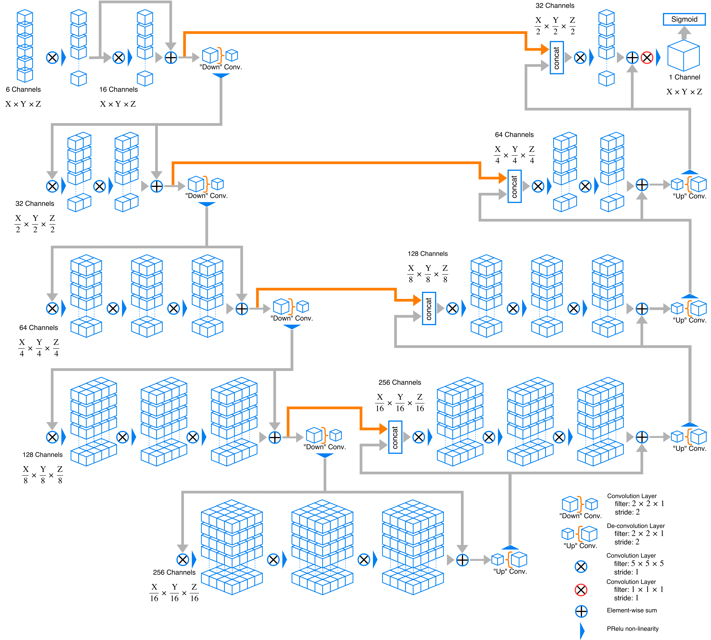

# VNet Tensorflow
Tensorflow implementation of the V-Net architecture for medical imaging segmentation.

## Tensorflow implementation of V-Net
This is a Tensorflow implementation of the [V-Net](https://arxiv.org/abs/1606.04797) architecture used for 3D medical imaging segmentation. This code adopts the tensorflow graph from https://github.com/MiguelMonteiro/VNet-Tensorflow. The repository covers training, evaluation and prediction modules for the (multimodal) 3D medical image segmentation in multiple classes.

### Visual Represetation of Network
Here is an example graph of network this code implements. Channel depth may change owning to change in modality number and class number.


### Features
- 3D data processing ready
- Augumented patching technique, requires less image input for training
- Multichannel input and multiclass output
- Generic image reader with SimpleITK support (Currently only support .nii/.nii.gz format for convenience, easy to expand to DICOM, tiff and jpg format)
- Medical image pre-post processing with SimpleITK filters
- Easy network replacement structure
- Sørensen and Jaccard similarity measurement as golden standard in medical image segmentation benchmarking
- Utilizing medical image headers to retrive space and orientation info after passthrough the network

## Development Progress

- [x] Training
- [x] Tensorboard visualization and logging
- [x] Resume training from checkpoint
- [x] Epoch training
- [x] Evaluation from single data
- [ ] Multichannel input
- [x] Multiclass output
- [x] C++ inference

## Usage
### Required Libraries
Known good dependencies
- Python 3.6
- Tensorflow 1.5 or above
- SimpleITK

### Folder Hierarchy
All training, testing and evaluation data should put in `./data`

    .
    ├── ...
    ├── data                      # All data
    │   ├── testing               # Put all testing data here
    |   |   ├── case1            
    |   |   |   ├── img.nii.gz    # Image for testing
    |   |   |   └── label.nii.gz  # Corresponding label for testing
    |   |   ├── case2
    |   |   ├──...
    │   ├── training              # Put all training data here
    |   |   ├── case1             # foldername for the cases is arbitary
    |   |   |   ├── img.nii.gz    # Image for testing
    |   |   |   └── label.nii.gz  # Corresponding label for testing
    |   |   ├── case2
    |   |   ├──...
    │   └── evaluation            # Put all evaluation data here
    |   |   ├── case1             # foldername for the cases is arbitary
    |   |   |   └── img.nii.gz    # Image for evaluation
    |   |   ├── case2
    |   |   ├──...
    ├── tmp
    |   ├── cktp                  # Tensorflow checkpoints
    |   └── log                   # Tensorboard logging folder
    ├── ...
    
If you wish to use image and label with filename other than `img.nii.gz` and `label.nii.gz`, please change the following values in `train.py`

```python
image_filename = 'img.nii.gz'
label_filename = 'label.nii.gz'
```

In segmentation tasks, image and label are always in pair, missing either one would terminate the training process.

### Training

You may run train.py with commandline arguments. To check usage, type ```python train.py -h``` in terminal to list all possible training parameters.

Available training parameters
```console
  --batch_size: Size of batch
    (default: '1')
    (an integer)
  --checkpoint_dir: Directory where to write checkpoint
    (default: './tmp/ckpt')
  --data_dir: Directory of stored data.
    (default: './data')
  --decay_factor: Exponential decay learning rate factor
    (default: '0.01')
    (a number) (not implemented)
  --decay_steps: Number of epoch before applying one learning rate decay
    (default: '100')
    (an integer) (not implemented)
  --display_step: Display and logging interval (train steps)
    (default: '10')
    (an integer)
  --drop_ratio: Probability to drop a cropped area if the label is empty. All
    empty patches will be droped for 0 and accept all cropped patches if set to
    1
    (default: '0.5')
    (a number)
  --epochs: Number of epochs for training
    (default: '2000')
    (an integer)
  --init_learning_rate: Initial learning rate
    (default: '0.1')
    (a number)
  --min_pixel: Minimum non-zero pixels in the cropped label
    (default: '10')
    (an integer)
  --patch_layer: Number of layers in data patch
    (default: '128')
    (an integer)
  --patch_size: Size of a data patch
    (default: '128')
    (an integer)
  --save_interval: Checkpoint save interval (epochs)
    (default: '1')
    (an integer)
  --shuffle_buffer_size: Number of elements used in shuffle buffer
    (default: '5')
    (an integer)
  --tensorboard_dir: Directory where to write tensorboard summary
    (default: './tmp/tensorboard') (deprecated)
  --train_dir: Directory where to write training event logs
    (default: './tmp/train_log') (deprecated)
 ```

#### Image batch preparation
Typically medical image is large in size when comparing with natural images (height x widht x layers x modality), where number of layers could up to hundred or thousands of slices. Also medical images are not bounded to unsigned char pixel type but accepts short, double or even float pixel type. This will consume large amount of GPU memories, which is a great barrier limiting the application of neural network in medical field.

Here we introduce serveral data augmentation skills that allow users to normalize and resample medical images in 3D sense. In `train.py`, you can access to `trainTransforms`/`testTransforms`. For general purpose we combine the advantage of tensorflow dataset api and SimpleITK (SITK) image processing toolkit together. Following is the preprocessing pipeline in SITK side to faciliate image augumentation with limited available memories.

1. Image Normalization (fit to 0-255)
2. Isotropic Resampling (adjustable size, in mm)
3. Paddinig (allow input image batch smaller than network input size to be trained)
4. Random Crop (randomly select a zone in the 3D medical image in exact size as network input)
5. Gaussian Noise

The preprocessing pipeline can easily be adjusted with following example code in `train.py`:
```python
trainTransforms = [
                NiftiDataset.Normalization(),
                NiftiDataset.Resample(0.4356),
                NiftiDataset.Padding((FLAGS.patch_size, FLAGS.patch_size, FLAGS.patch_layer)),
                NiftiDataset.RandomCrop((FLAGS.patch_size, FLAGS.patch_size, FLAGS.patch_layer),FLAGS.drop_ratio,FLAGS.min_pixel),
                NiftiDataset.RandomNoise()
                ]
```

To write you own preprocessing pipeline, you need to modify the preprocessing classes in `NiftiDataset.py`

#### Tensorboard
In training stage, result can be visualized via Tensorboard. Run the following command:
```console
tensorboard --logdir=./tmp/log
```

Once TensorBoard is running, navigate your web browser to ```localhost:6006``` to view the TensorBoard.

Note: ```localhost``` may need to change to localhost name by your own in newer version of Tensorboard.

### Evaluation
To evaluate image data, first place the data in folder ```./data/evaluate```. Each image data should be placed in separate folder as indicated in the folder hierarchy

There are several parameters you need to set in order manually
- `model_path`, the default path is at `./tmp/ckpt/checkpoint-<global_step>.meta`
- `checkpoint_dir`, the default path is at `./tmp/ckpt`
- `patch_size`, this value need to be same as the one used in training
- `patch_layer`, this value need to be same as the one used in training
- `stride_inplane`, this value should be <= `patch_size`
- `stride_layer`, this value should be <= `patch_layer`
- `batch_size`, currently only support single batch processing

Run `evaluate.py` after you have modified the corresponding variables. All data in `./data/evaluate` will be iterated. Segmented label is named as `label_vnet.nii.gz` in same folder of the respective `img.nii.gz`.

You may change output label name by changing the line `writer.SetFileName(os.path.join(FLAGS.data_dir,case,'label_vnet.nii.gz'))`

Note that you should keep preprocessing pipeline similar to the one in `train.py`, but without random cropping and noise.

## C++ Inference
We provide a C++ inference example under directory [cxx](./cxx). For C++ implementation, please follow the guide [here](./cxx/README.md)

## Citations
Use the following Bibtex if you need to cite this repository:
```bibtex
@misc{jackyko1991_vnet_tensorflow,
  author = {Jacky KL Ko},
  title = {Implementation of vnet in tensorflow for medical image segmentation},
  howpublished = {\url{https://github.com/jackyko1991/vnet-tensorflow}},
  year = {2018},
  publisher={Github},
  journal={GitHub repository},
}

@inproceedings{milletari2016v,
  title={V-net: Fully convolutional neural networks for volumetric medical image segmentation},
  author={Milletari, Fausto and Navab, Nassir and Ahmadi, Seyed-Ahmad},
  booktitle={3D Vision (3DV), 2016 Fourth International Conference on},
  pages={565--571},
  year={2016},
  organization={IEEE}
}

@misc{MiguelMonteiro_VNet_Tensorflow,
  author = {Miguel Monteiro},
  title = {VNet-Tensorflow: Tensorflow implementation of the V-Net architecture for medical imaging segmentation.},
  howpublished = {\url{https://github.com/MiguelMonteiro/VNet-Tensorflow}},
  year = {2018},
  publisher={Github},
  journal={GitHub repository},
}
```

## Author
Jacky Ko jackkykokoko@gmail.com
